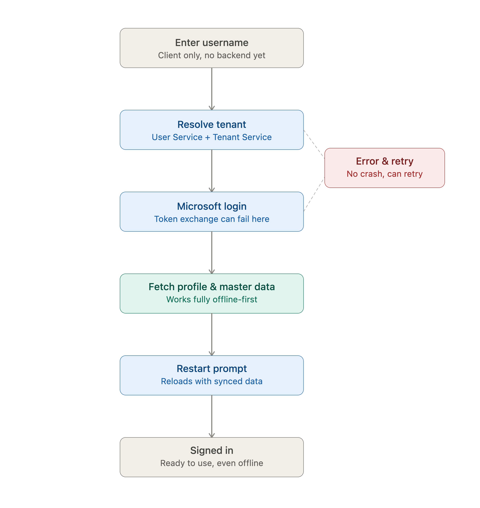

# Test Cases - Flow 0: Sign In

Based on the flow, here are the test cases I put together for the sign-in process, with a particular focus on bad-connectivity scenarios — since that's a core characteristic of this product. The goal throughout is making sure the app handles these situations gracefully, without crashing or leaving the user stuck.



## 🔎 Backend Flow Breakdown

Before diving into the test cases, here's how each step in the sign-in flow likely maps to the backend services, along with the specific risks I'd want to validate at each point:

- **Step 1 — Username input.** Handled entirely on the client, no backend call yet. In practice, usernames can get tricky between users, so I'd want to make sure the username is checked as registered before input is even accepted downstream.
- **Step 2 — `/user/who`.** Hits the **User Service**, which most likely calls the **Tenant Service** internally to resolve which tenant the username belongs to. This mapping is critical — if the username isn't mapped to any tenant, the flow should stop right here with a clear error message, not a generic failure.
- **Step 3 — Tenant lookup.** Owned by the **Tenant Service**. Once the tenant is mapped to the username, its status needs to be checked — if it's suspended or inactive, the flow should stop here with a message distinct from a plain "user not found."
- **Step 4 — Microsoft login.** Happens entirely outside WeMine's backend, on Azure AD. The token comes back and needs to be exchanged/verified by the **User Service** — a common failure point. Even though this step is external, the app still needs to handle a failed token exchange gracefully with a clear error.
- **Step 5 — `/user/me`.** Back to the **User Service**, returning the profile. This needs to stay consistent with the tenant resolved in step 3 — if the profile isn't properly mapped to that tenant, permissions on the profile should be checked before proceeding.
- **Step 6 — `/tenant/master`.** Owned by the **Tenant Service**, likely just a list of what needs to be fetched rather than the data itself. Username, tenant, and user profile all need to stay consistent with each other through this point — there has to be a clear, unambiguous mapping between the three.
- **Step 7 — Fetching each master data endpoint.** The messiest part, spanning multiple services at once (Tenant Service for locations/sublocations/areas, and likely others). This is the trickiest step — every endpoint's response needs to be 100% correct and not mixed up with another's, and the app needs to handle partial failures gracefully (if one endpoint fails, the rest should still be usable).
- **Step 8 — Restart prompt.** Purely client-side. Any updated data should be properly reflected in the app after restart, and the app should not crash or lose data in the process.

## ✅ Test Cases

```md
ID Test Case: TC-001
Title: Sign in with no internet connection at all
Priority: High
Platform: Mobile & Web
Service: - (never reaches a backend service)
Pre-Condition: No internet connection at all
Steps:
1. Open the app
2. Input username
3. Submit login
Expected Result: A clear connection error message is shown, no infinite loading, no crash
```

```md
ID Test Case: TC-002
Title: `/user/who` timeout or slow response
Priority: High
Platform: Mobile & Web
Service: User Service
Pre-Condition: Simulated network delay/timeout on the who endpoint
Steps:
1. Input username
2. Submit while the backend responds slowly
Expected Result: A reasonable loading state is shown, proper timeout handling with retry or error message, no permanent stuck state
```

```md
ID Test Case: TC-003
Title: Tenant not found for the given username
Priority: High
Platform: Mobile & Web
Service: Tenant Service (via User Service)
Pre-Condition: Username isn't associated with any tenant
Steps:
1. Input an unregistered username
2. Submit
Expected Result: A specific "tenant not found" message is shown, not a generic error
```

```md
ID Test Case: TC-004
Title: Tenant found but suspended or inactive
Priority: High
Platform: Mobile & Web
Service: Tenant Service
Pre-Condition: Tenant is deliberately set to inactive on the backend
Steps:
1. Input a username belonging to the inactive tenant
2. Submit
Expected Result: An error distinct from "user not found" is shown, clearly stating the tenant is inactive, and the flow does not proceed to MS login
```

```md
ID Test Case: TC-005
Title: Token exchange with Microsoft fails after a successful MS login
Priority: High
Platform: Mobile & Web
Service: User Service
Pre-Condition: Login succeeds on the MS screen, but the token is invalid or expired by the time it's sent back
Steps:
1. Complete MS login
2. Backend fails to exchange the token
Expected Result: A clear error is shown, user can retry, no stuck loading
```

```md
ID Test Case: TC-006
Title: Happy path — valid username, all services healthy
Priority: High
Platform: Mobile & Web
Service: User Service, Tenant Service, Workflow Service
Pre-Condition: User is registered, all backend services are healthy
Steps:
1. Open the app
2. Input username
3. Complete MS login
4. Wait for the sync to finish
Expected Result: Successful sign-in, all master data fully downloaded, restart prompt appears
```

```md
ID Test Case: TC-007
Title: Re-login after a long offline period
Priority: Medium
Platform: Mobile & Web
Service: Tenant Service, Workflow Service
Pre-Condition: User has logged in before and was offline for an extended time
Steps:
1. Open the app after the offline period
2. Reconnect to the internet
Expected Result: The app re-syncs without duplicating or losing local data (needs confirmation from backend team on whether delta sync via something like an `updated_since` param is supported, or if it's always a full refetch)
```

```md
ID Test Case: TC-008
Title: Wrong password on MS login
Priority: Medium
Platform: Mobile & Web
Service: External Microsoft (not WeMine backend)
Pre-Condition: Username is valid
Steps:
1. Reach the MS login screen
2. Enter a wrong password
Expected Result: A clear error from MS login is shown, user can retry
```

```md
ID Test Case: TC-009
Title: Cancel mid Microsoft login
Priority: Low
Platform: Mobile & Web
Service: External Microsoft
Pre-Condition: Currently on the MS login screen
Steps:
1. Click cancel or back before submitting the password
Expected Result: The app returns cleanly to the previous step, no crash or stuck state
```

</details>

## 🛠️ Tool Choice

**API layer** (`/user/who`, `/user/me`, `/tenant/master`, and each master data endpoint) — Postman/Newman. A lot of these cases need direct control at the service level, like simulating one service going down without touching the others, and that's faster and more precise at the API layer than driving it through the UI.

**Mobile UI** — Maestro, to validate the end-to-end experience, especially the cases where what matters is what the user actually sees — the progress bar behavior, error states, and so on under bad network conditions.

**Web UI** — Playwright, mainly because it has offline mode and network condition control built in (`context.setOffline()`, request interception), which maps directly to the kind of bad-connectivity scenarios this product is built around.
