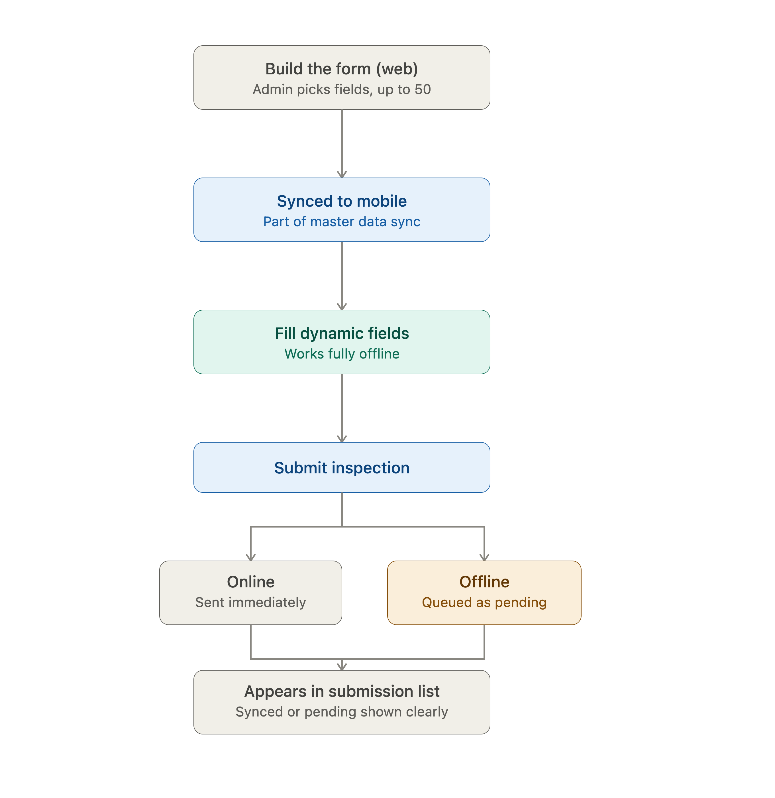

# Test Cases - Flow 1: Equipment Inspection Form

This flow has two sides that need to work together: the **form builder on WeMineOffice** (web), where an admin defines the fields, and the **Equipment Inspection submission** on WeMine (mobile), where the actual field worker fills it out — very likely with no signal at all. The test cases below lean heavily into that second part, since it's where the product's core promise (fully functional offline, on a dynamically-built form) is actually put to the test.



## 🔎 Backend Flow Breakdown

- **Web: building the form.** The admin picks field types (Text, Date Picker, Select, Radio, Image Picker) up to 50 fields per form, and saves it. This most likely goes to the **Workflow Service**, tied to a form code, since Workflow Service owns "all process flow" including form definitions.
- **Form schema reaching mobile.** The form schema itself doesn't get fetched live when the user opens the submission screen — it was already pulled down as part of the `forms` master data during sign-in, because I want to make sure that when bad connection happens, it's already anticipated.
- **Mobile: opening Equipment Inspection.** The list of previous submissions is shown first. It's not clear yet whether this list is purely local, so at minimum it should work from local cache first, then reconcile with backend once online.
- **Mobile: starting a new submission.** User selects a Form Code, and the app renders fields dynamically based on the locally cached schema. Since this depends entirely on local data, it should work with zero connectivity.
- **Mobile: filling and submitting.** Text, date, select, and radio fields are straightforward local state. Image Picker is the risky one — images are large, and on a poor connection they need to be stored locally first and uploaded separately/later rather than blocking the whole submission.
- **Submission handling — online vs offline.** If online, the submission (and its images) goes to the backend. If offline, the submission needs to queue locally with a clear "pending" state, and sync automatically once connectivity returns — without creating a duplicate if the user reopens the app mid-sync.

## ✅ Test Cases


```md
ID Test Case: TC-001
Title: Submit an inspection form fully offline
Priority: High
Platform: Mobile
Service: Workflow Service (once synced), local storage while offline
Pre-Condition: Form schema already synced locally, device has no internet connection
Steps:
1. Open Equipment Inspection
2. Start a new submission
3. Fill all fields
4. Submit
Expected Result: Submission is saved locally with a clear "pending sync" status, no crash, no data loss, and the app doesn't try to block submission waiting for a connection
```

```md
ID Test Case: TC-002
Title: Queued offline submission syncs once connection returns
Priority: High
Platform: Mobile
Service: Workflow Service
Pre-Condition: One or more submissions are queued locally from being submitted offline
Steps:
1. Reconnect to the internet
2. Wait for the app to auto-sync
Expected Result: Pending submissions are sent to the backend, their status updates from "pending" to "synced," and no duplicate entries are created even if sync is interrupted and retried
```

```md
ID Test Case: TC-003
Title: Each field type renders and validates correctly
Priority: High
Platform: Mobile
Service: - (client-side rendering based on locally synced schema)
Pre-Condition: A form exists with all supported field types: Input Text, Date Picker, Select, Radio, Image Picker
Steps:
1. Open the submission form
2. Interact with each field type
Expected Result: Each field renders correctly per its type, accepts only valid input (e.g. date picker doesn't allow free text), and mandatory fields block submission when left empty
```

```md
ID Test Case: TC-004
Title: Form with the maximum 50 fields
Priority: High
Platform: Web & Mobile
Service: Workflow Service
Pre-Condition: A form is built with exactly 50 fields on the web form builder
Steps:
1. Save the form on web
2. Sync it to mobile
3. Open it for submission
Expected Result: All 50 fields are saved correctly on web, sync down completely to mobile without truncation, and the submission form remains responsive and doesn't lag or crash with that many fields
```

```md
ID Test Case: TC-005
Title: Attempting to exceed the 50 field limit
Priority: Medium
Platform: Web
Service: Workflow Service
Pre-Condition: A form already has 50 fields in the builder
Steps:
1. Try to add a 51st field
Expected Result: The builder blocks the addition with a clear message about the field limit, rather than silently failing or allowing it and breaking mobile rendering
```

```md
ID Test Case: TC-006
Title: Radio field with more than 4 options
Priority: Medium
Platform: Web
Service: Workflow Service
Pre-Condition: A Radio field is being configured in the form builder
Steps:
1. Try to add a 5th option to a Radio field
Expected Result: The builder prevents adding a 5th option per the stated max-of-4 constraint, with a clear message rather than a silent failure
```

```md
ID Test Case: TC-007
Title: Form schema updated on web while mobile still has the old version cached
Priority: High
Platform: Mobile & Web
Service: Workflow Service
Pre-Condition: A form is edited on web (e.g. a field added/removed) after mobile already synced the older version, and mobile hasn't re-synced yet
Steps:
1. Open the same form code for submission on mobile using the outdated cached schema
Expected Result: The app either clearly flags that the form may be outdated and needs a re-sync, or safely falls back to the last known-good schema — it should not silently submit data that no longer matches the current schema on the backend
```

```md
ID Test Case: TC-008
Title: Image Picker with poor connection
Priority: High
Platform: Mobile
Service: Workflow Service (for the upload)
Pre-Condition: Weak/unstable connection while submitting a form with an image attached
Steps:
1. Attach an image via Image Picker
2. Submit the form
Expected Result: The image is stored locally and uploads independently/retries on its own if it fails, without blocking or corrupting the rest of the submission's text/select/date data
```

```md
ID Test Case: TC-009
Title: Previous submissions list shows pending vs synced state clearly
Priority: Medium
Platform: Mobile
Service: Workflow Service (for synced items), local storage (for pending items)
Pre-Condition: A mix of offline-submitted (pending) and already-synced submissions exist
Steps:
1. Open the Equipment Inspection submission list
Expected Result: Pending and synced submissions are visually distinguishable, and the list is accurate even if the app was closed and reopened before sync completed
```

```md
ID Test Case: TC-010
Title: Submit form without filling mandatory fields
Priority: High
Platform: Mobile
Service: - (client-side validation)
Pre-Condition: Form has at least one mandatory field left empty
Steps:
1. Attempt to submit without filling the mandatory field
Expected Result: Submission is blocked with a clear indication of which field(s) are missing, no partial submission is created
```

```md
ID Test Case: TC-011
Title: Select field with a large number of options
Priority: Low
Platform: Mobile
Service: - (client-side rendering)
Pre-Condition: A Select field is configured with a large option list (e.g. a long list of locations)
Steps:
1. Open the field
2. Scroll/search through options
3. Select one
Expected Result: The field remains responsive and searchable even with a long option list, no lag or crash
```

## 🛠️ Tool Choice

**Web form builder** — Playwright. Building and validating forms (field types, the 50-field limit, the 4-option radio limit) is a UI-heavy, deterministic flow on web, and Playwright's ability to interact reliably with dynamic form elements fits well here.

**Mobile submission flow** — Maestro for most of the flow, because it runs well on both iOS and Android under poor connection conditions.

**API / schema layer** — Postman/Newman or REST-assured, mainly for verifying that the form schema saved via the builder is exactly what gets served back to mobile through the master data sync, since a mismatch there would be silent and hard to catch from the UI alone.

**Offline state validation** — for cases like TC-001, TC-002, and TC-009, checking the actual local storage/DB on the device (not just what's visible in the UI) is worth doing directly via adb/device shell, to confirm pending submissions are stored correctly and not silently dropped.
