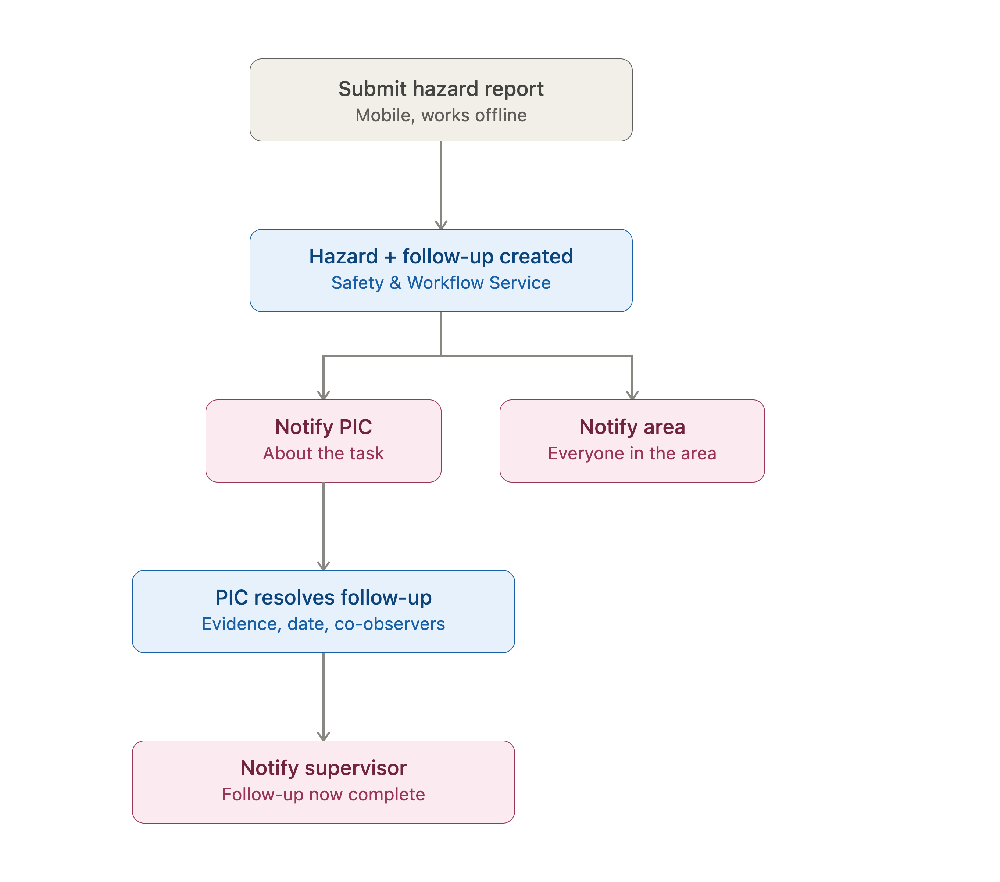

# Test Cases - Flow 2: Safety Hazard Report

This flow is different from the first two in one important way: it's not just a form submission, it's the start of a **multi-role workflow** — a reporter files a hazard, a PIC gets a follow-up task, everyone in the area gets notified, and eventually a supervisor gets notified too. So on top of the offline-first characteristic that runs through the whole product, this flow also lives or dies on whether notifications and follow-up tasks are triggered correctly and reach the right people.




## 🔎 Backend Flow Breakdown

- **Mobile: reporting a hazard.** The reporter fills Location, Sublocation, and Area (all mandatory Selects, likely populated from locally synced master data owned by the **Tenant Service**), an optional Area Description, mandatory Evidence (Image Picker), and a mandatory PIC field pre-selected to the reporter (populated from the employees list, likely **User Service**). Since this is a field-report use case, this step needs to work reliably offline — a hazard report failing silently because of bad signal is a real safety risk, not just a UX annoyance.
- **On submission — two things get created.** A hazard entry is created (most likely owned by the **Safety Service**, since it's explicitly responsible for safety-related features), and a follow-up task is generated alongside it (likely the **Workflow Service**, since it owns "all process flow"). These two need to be created together — if one succeeds and the other fails, the hazard exists without an owner following up on it, or a task exists that doesn't trace back to a real hazard.
- **Notification fan-out.** Two separate notifications go out from here, likely via the **Notification Service**: the PIC gets notified specifically about their follow-up task, while everyone in the affected area gets a broader notification about the hazard itself. These are different audiences and different message content, so they need to be tested as genuinely separate notification triggers, not just "a notification was sent."
- **PIC: resolving the follow-up.** The PIC goes to the location, fixes the issue, and submits the follow-up with Evidence (Image Picker), a mandatory Resolution Date (DateTime picker), and Co Observer — a Select field with a "+" button to add more Co Observers, which is a dynamic multi-select pattern not seen in the other flows.
- **Final notification.** Once the follow-up is submitted, the Direct Supervisor of the area gets notified. This closes the loop, but it also means there's a third distinct notification trigger depending on a separate piece of data (who the "direct supervisor" of that area is) resolving correctly.

## ✅ Test Cases

```md
ID Test Case: TC-001
Title: Report a hazard fully offline
Priority: High
Platform: Mobile
Service: Safety Service, Workflow Service (once synced), local storage while offline
Pre-Condition: Master data (locations, sublocations, areas, employees) already synced locally, device has no internet connection
Steps:
1. Open Hazard menu
2. Fill Location, Sublocation, Area, Evidence, and PIC
3. Submit
Expected Result: The report is saved locally with a clear "pending sync" status, no crash, no data loss — a hazard report should never be silently dropped because of no connection
```

```md
ID Test Case: TC-002
Title: Offline hazard report syncs and correctly triggers hazard entry + follow-up task
Priority: High
Platform: Mobile
Service: Safety Service, Workflow Service
Pre-Condition: A hazard report is queued locally from being submitted offline
Steps:
1. Reconnect to the internet
2. Wait for the app to auto-sync
Expected Result: Both the hazard entry and its follow-up task are created on the backend once synced, not just the hazard without a task (or vice versa), and no duplicates are created if sync is retried
```

```md
ID Test Case: TC-003
Title: PIC receives a notification specifically about the follow-up task
Priority: High
Platform: Mobile
Service: Notification Service
Pre-Condition: A hazard report is submitted online with a specific user set as PIC
Steps:
1. Submit the hazard report
2. Check notification received by the PIC
Expected Result: The PIC receives a notification referencing the follow-up task assigned to them, distinct in content from the general hazard notification sent to the area
```

```md
ID Test Case: TC-004
Title: All people in the affected area receive the hazard notification
Priority: High
Platform: Mobile
Service: Notification Service
Pre-Condition: A hazard report is submitted for an area with multiple registered employees, including people who are not the PIC
Steps:
1. Submit the hazard report
2. Check notifications received by other people registered to that area
Expected Result: All employees associated with the reported area receive the hazard notification, not just the PIC — and the notification is scoped correctly to that specific area, not broadcast tenant-wide
```

```md
ID Test Case: TC-005
Title: Submit hazard report without a mandatory field
Priority: High
Platform: Mobile
Service: - (client-side validation)
Pre-Condition: One of the mandatory fields (Location, Sublocation, Area, Evidence, or PIC) is left empty
Steps:
1. Attempt to submit without filling a mandatory field
Expected Result: Submission is blocked with a clear indication of which field is missing, no hazard entry or follow-up task is created
```

```md
ID Test Case: TC-006
Title: PIC field is pre-selected to the reporter but can be changed
Priority: Medium
Platform: Mobile
Service: - (client-side, resolved against User Service data)
Pre-Condition: Reporter opens a new hazard report form
Steps:
1. Open the hazard report form
2. Check the default value of the PIC field
3. Change it to a different employee
Expected Result: PIC defaults to the reporter as stated, but can be reassigned to another valid employee before submission, and the reassigned PIC is who actually receives the follow-up task notification
```

```md
ID Test Case: TC-007
Title: Follow-up submission with multiple Co Observers added via the "+" button
Priority: Medium
Platform: Mobile
Service: Workflow Service
Pre-Condition: PIC has an assigned follow-up task ready to be resolved
Steps:
1. Open the follow-up task
2. Fill Evidence and Resolution Date
3. Add multiple Co Observers using the "+" button
4. Submit
Expected Result: All added Co Observers are saved correctly against the follow-up record, the "+" button has no unexpected upper limit that silently blocks adding more, and removing an added Co Observer before submit works cleanly
```

```md
ID Test Case: TC-008
Title: Follow-up submission without a mandatory Resolution Date
Priority: High
Platform: Mobile
Service: - (client-side validation)
Pre-Condition: PIC is resolving a follow-up task
Steps:
1. Fill Evidence and Co Observer
2. Leave Resolution Date empty
3. Attempt to submit
Expected Result: Submission is blocked with a clear message that Resolution Date is required, no follow-up completion is recorded
```

```md
ID Test Case: TC-009
Title: Direct Supervisor is notified after follow-up is submitted
Priority: High
Platform: Mobile
Service: Notification Service
Pre-Condition: Follow-up task is completed and submitted for an area with a defined Direct Supervisor
Steps:
1. Submit the completed follow-up task
2. Check notification received by the Direct Supervisor of that area
Expected Result: The Direct Supervisor receives a notification referencing the resolved hazard, and no notification is sent if the area has no Direct Supervisor configured (this edge case needs a defined fallback behavior rather than a silent failure)
```

```md
ID Test Case: TC-010
Title: Hazard entry created but Notification Service fails to send notifications
Priority: High
Platform: Mobile
Service: Safety Service, Notification Service
Pre-Condition: Notification Service is deliberately down/unresponsive at submission time
Steps:
1. Submit a hazard report while Notification Service is failing
Expected Result: The hazard entry and follow-up task are still created successfully — a Notification Service outage should not block or roll back the actual hazard record, though the missed notifications should ideally be retried once the service recovers
```

```md
ID Test Case: TC-011
Title: Follow-up submission fully offline
Priority: High
Platform: Mobile
Service: Workflow Service (once synced), local storage while offline
Pre-Condition: PIC has an assigned follow-up task, device has no internet connection
Steps:
1. Open the follow-up task
2. Fill Evidence, Resolution Date, and Co Observer
3. Submit
Expected Result: The follow-up completion is saved locally with a "pending sync" status, and syncs correctly (including triggering the Direct Supervisor notification) once connectivity returns
```

```md
ID Test Case: TC-012
Title: Hazard list reflects both pending and synced reports
Priority: Medium
Platform: Mobile
Service: Safety Service (synced items), local storage (pending items)
Pre-Condition: A mix of offline-submitted (pending) and already-synced hazard reports exist
Steps:
1. Open the Hazard menu list
Expected Result: Pending and synced reports are visually distinguishable, and the list remains accurate even if the app was closed and reopened before sync completed
```

## 🛠️ Tool Choice

**Mobile submission flow** — Maestro, for the same reason as the previous flows: it handles the offline-report and offline-follow-up scenarios well across both platforms.

**API / notification verification** — Postman/Newman or REST-assured to trigger submissions directly and verify the resulting hazard entry, follow-up task, and notification payloads at the API level, since checking "did the right three people get notified with the right content" is far more reliable to assert against actual API/service responses than by inspecting push notifications on multiple physical devices.

**Notification Service specifically** — this is the one area across all three flows where I'd want a way to intercept or mock outgoing notifications (e.g. a test webhook endpoint standing in for push/email) rather than relying on real devices receiving real notifications, so the PIC/area/supervisor fan-out logic (TC-003, TC-004, TC-009) can be asserted deterministically.

**Offline state validation** — same as Flow 1: checking local storage/DB directly via adb/device shell for TC-001, TC-002, and TC-011, to confirm pending hazard reports and follow-ups are actually persisted correctly rather than just trusting what the UI shows.
